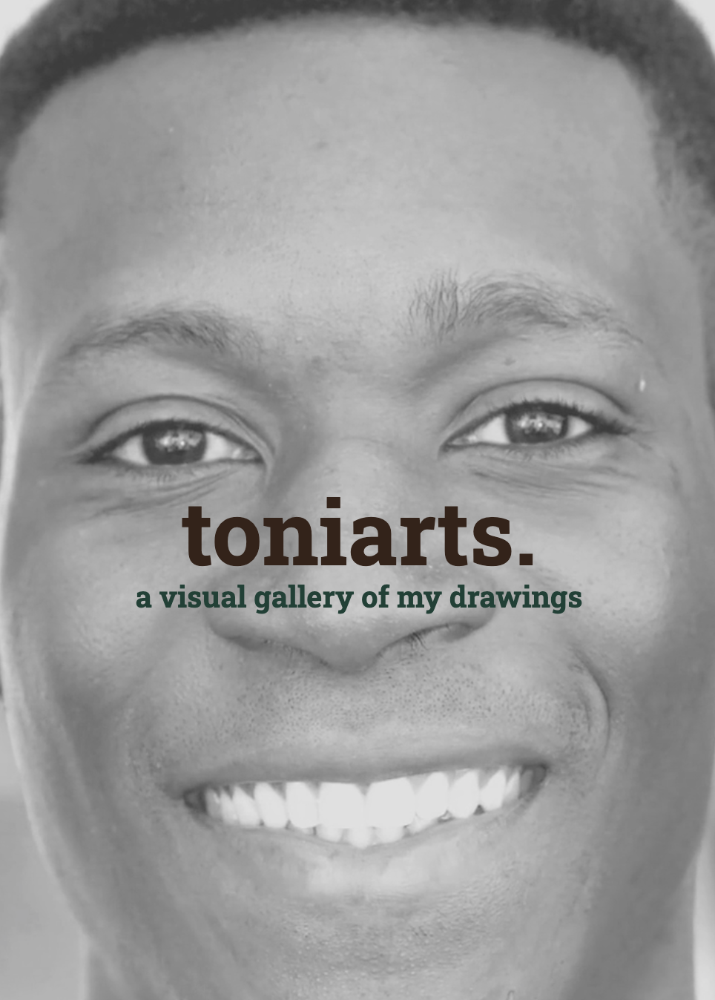
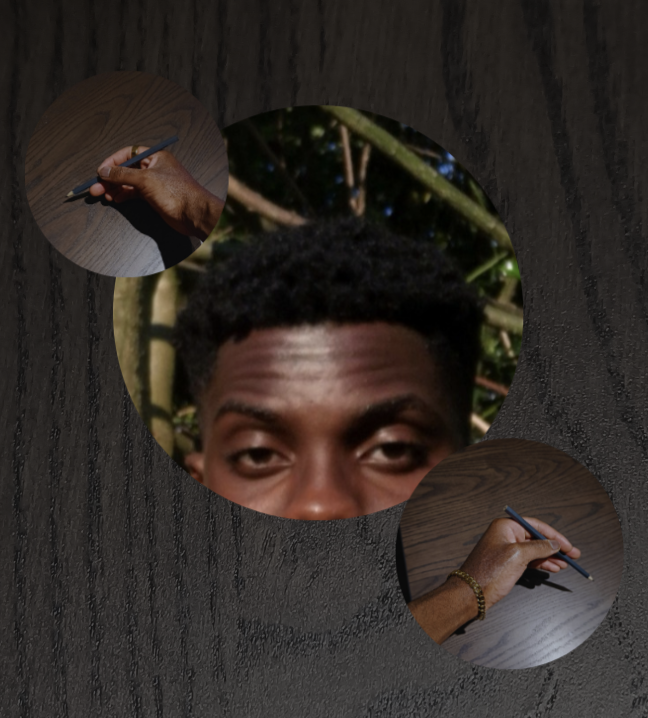
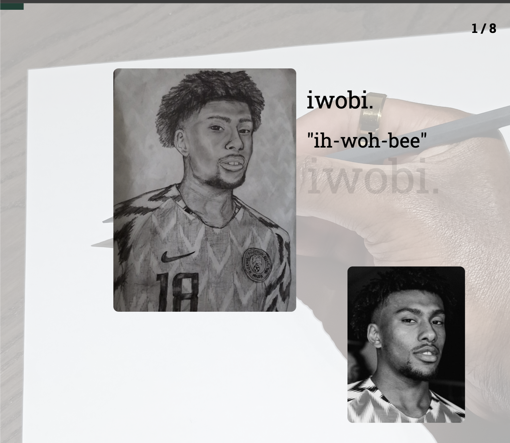
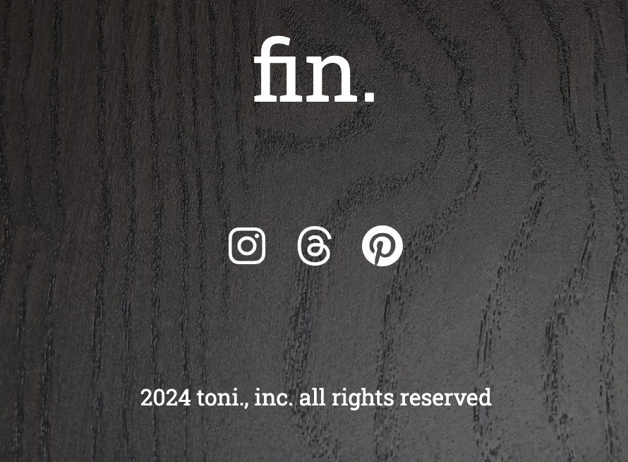

# toniarts
A visually appealing website which shows a gallery of my drawings exploring the beauty and depth of the Black diaspora; from fashion, to sports, to music and even family. The website was developed using React (including their libraries for cool scrolling and transition features) and TailwindCSS.

### Introduction and about page
The main intention of this project was to combine the talents of front-end design and drawing. In the introduction of the page, I bring a visually appealing parallax scroll animation, minimalistic title features and smooth transitions to introduce the user.

### Gallery
The main aspect of the project: cool hybrid horizontal scrolling with a progress bar to track the current active image. The drawings show the comparison real-life pic as well as other details i.e. the name of the drawing, pronuncation etc.

### Footer
The ending page of the scroll to conclude the gallery presentation. This includes external social media links. The is also copyright claim over my own drawings in this website presentation.
